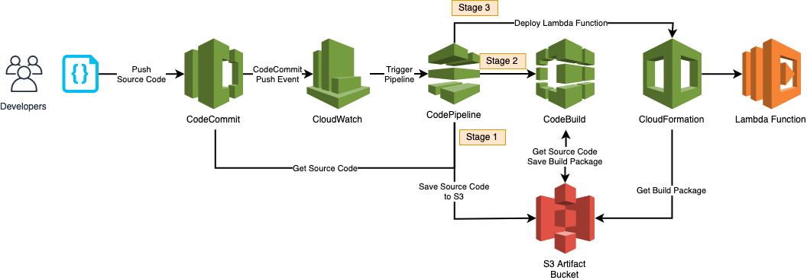

## Quick Start
This Quick Start will get you up and running with CI/CD deployment of Lambda Functions using AWS CodeCommit, CodePipeline, CodeBuild and CloudFormation services.

## Deploy Quick Start Resources

Deploy script creates the initial AWS resources.

- Code Commit repository
  - Save your solution source code
- S3 Bucket
  - Save source code and build packages
- CloudWatch event rule triggers Code Pipeline when create|update events are observed
  - Only applies to specific CodeCommit Repo and 'main' branch
- Code Pipeline
  - 3 stages are configured
    - 1) Pull latest source code from code commit from main branch and save to S3
    - 2) CodeBuild pulls S3 source code, packages Lambda Function and save the artifact back to S3
    - 3) Cloudformation template deploys or updates the Lambda Function using the latest CodeBuild artifact
  - Artifact variables (bucket and object) are passed into stage 3 as parameters from stage 2 (CodeBuild) output
- CodeBuild project (to build the Lambda Function)
   - Packages source code
   - Saves package back to S3
- Cloudformation
  - Deploy Lambda Function using CodeBuild package artifact

`./deploy.sh create`

## Update Quick Start Resources

Deploy script updates already deployed resources (if required).

`./deploy.sh update`

## Push Source Code

Push source code to the newly created CodeCommit repository. Pipeline is triggered within minutes and Hello World Lambda Function will be deployed within 15 minutes.

### Monitoring CI/CD Progress
Monitoring of Quick Start resources can be achieve by reviewing the following AWS Services:
- Check Code Commit contains the latest code in branch 'main'
- Check CloudWatch Event Rules
- Check Code Pipeline job for progress
- Check CodeBuild job progress
- Check Cloudformation stack resources

### Repository Structure

| File      | Description |
| ----------- | ----------- |
| src/lambda/buildspec.yaml      | CodeBuild specification to package source code |
| src/lambda/lambda-function/handler.py   | Hello World Lambda source code |
| main/codebuild-lambda.yaml   | CodeBuild resource to build Lambda Functions |
| main/lambda-function.yaml   | Provision Lambda Function template  |
| deploy.sh   | Script to provision Quick Start resources |
| parameters.json   | Parameters to deploy Quick Start resources |
| resources.yaml   | Quick Start resources template |

## Copyright Amazon.com, Inc. or its affiliates. All Rights Reserved.
## SPDX-License-Identifier: MIT-0

## Security

See [CONTRIBUTING](CONTRIBUTING.md#security-issue-notifications) for more information.

## License

This library is licensed under the MIT-0 License. See the LICENSE file.